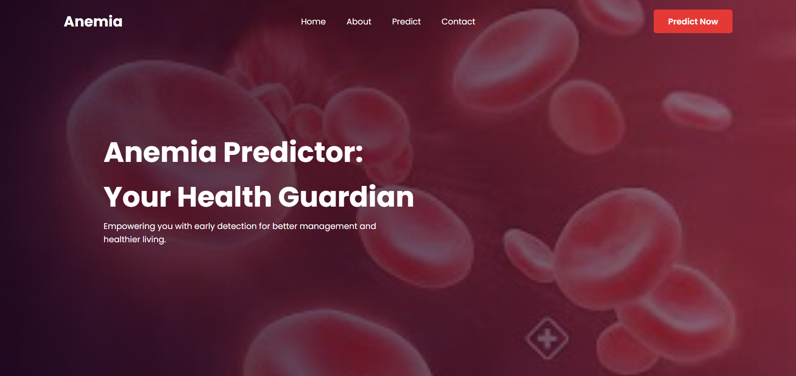
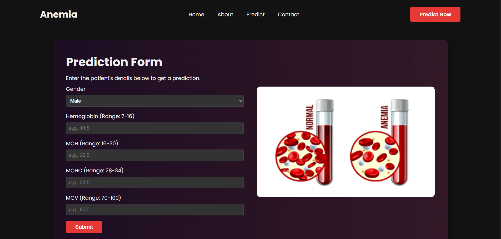
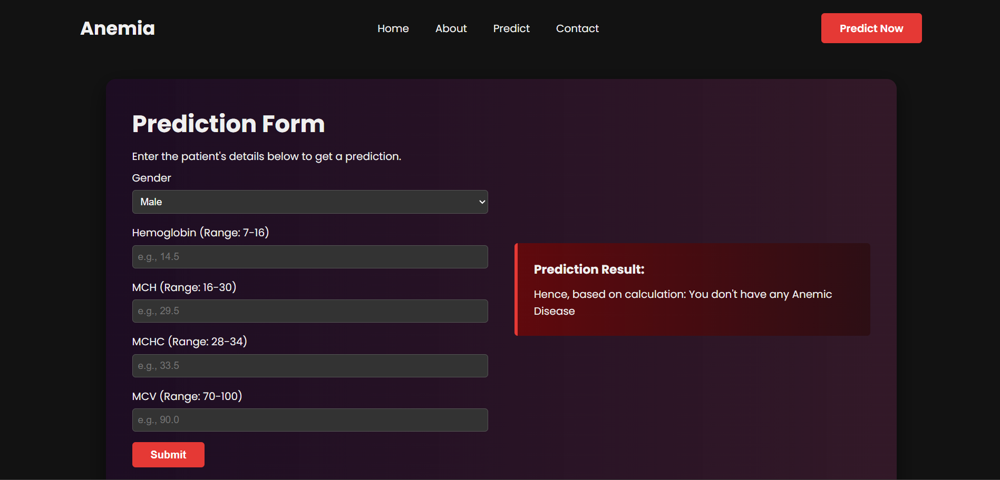

# 🩸 Anemia Sense: Machine Learning-Based Anemia Prediction System

Anemia Sense is a Machine Learning web application that predicts the likelihood of anemia based on basic blood test parameters. The project combines data analysis, machine learning, and Flask web deployment to provide an easy-to-use prediction interface.

> **Disclaimer:** This project was developed for educational purposes as part of the SmartBridge Machine Learning Internship. It is not intended to replace professional medical diagnosis.

---

# 🚀 Features

- Predicts the likelihood of anemia using patient blood parameters
- Interactive web application built with Flask
- Compares multiple Machine Learning algorithms before selecting the final model
- Performs Exploratory Data Analysis (EDA)
- Handles class imbalance before model training
- Uses a trained Gradient Boosting model for prediction

---

# 🛠️ Tech Stack

### Programming Language
- Python

### Machine Learning
- Scikit-learn
- Pandas
- NumPy

### Data Visualization
- Matplotlib
- Seaborn

### Web Development
- Flask
- HTML
- CSS

---

# 📊 Input Features

The prediction model uses the following parameters:

- Gender
- Hemoglobin
- MCH (Mean Corpuscular Hemoglobin)
- MCHC (Mean Corpuscular Hemoglobin Concentration)
- MCV (Mean Corpuscular Volume)

---

# 🤖 Machine Learning Workflow

```text
Dataset
   │
   ▼
Exploratory Data Analysis
   │
   ▼
Data Preprocessing
   │
   ▼
Class Balancing
   │
   ▼
Model Training
   │
   ▼
Model Evaluation
   │
   ▼
Gradient Boosting Selected
   │
   ▼
Model Saved (model.pkl)
   │
   ▼
Flask Web Application
   │
   ▼
Prediction
```

---

# 📈 Models Evaluated

The following Machine Learning algorithms were trained and compared:

- Logistic Regression
- Random Forest
- Gaussian Naive Bayes
- Support Vector Machine (SVM)
- Gradient Boosting Classifier ✅ (Final Model)

The Gradient Boosting Classifier was selected as the final model after comparing the performance of multiple classification algorithms.

---

## 📄 Documentation

Detailed reports covering project planning, data preprocessing, model development, and optimization are available in the **Project Report** folder.

---

# 📂 Project Structure

```text
anemia_sense/
│
├── images/
│   ├── home.png
│   ├── prediction.png
│   └── result.png
│
├── static/
├── templates/
├── Project Report/
├── app.py
├── model.pkl
├── requirements.txt
└── README.md
```

---

# 📸 Application Screenshots

## 🏠 Home Page



---

## 📝 Prediction Form



---

## ✅ Prediction Result



---

# ▶️ How to Run

Clone the repository

```bash
git clone https://github.com/priyana2764/anemia_sense.git
```

Move into the project directory

```bash
cd anemia_sense
```

Run the Flask application

```bash
python app.py
```

Open your browser and visit

```
http://127.0.0.1:5000
```

---

# 📌 Future Improvements

- Improve model performance using hyperparameter tuning
- Add stronger input validation
- Deploy the application on a cloud platform
- Improve UI responsiveness
- Add a user-friendly dashboard

---

# 📖 Acknowledgements

This project was completed as part of the **SmartBridge Machine Learning Internship**, covering the complete Machine Learning workflow from data preprocessing and model development to Flask deployment.

---

# 👩‍💻 Author

**Priyana Agrawal**

Aspiring Data Scientist | AI & Machine Learning Enthusiast